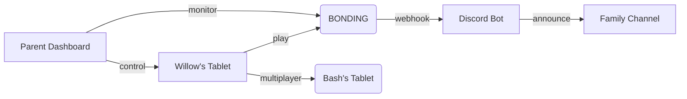

# P31 Companion Ecosystem — Production Package Plan
## Ages 6-8 (Cross-Generational Engagement)

**Created:** 2026-03-24  
**Target:** P31 Labs Kids Package  
**Mode:** Architect

---

## 🎯 Vision

An engaging, safe, and accessible companion ecosystem that enables:
- **Bash (10)** and **Willow (6)** to play alongside Dad from separate devices
- **Dad (Will)** to monitor and engage with his kids through documented timestamps
- **Extended family** to participate in the cognitive accessibility network

---

## 📦 Core Components

### 1. BONDING Game (Already Shipped ✅)
- **Status:** Live at bonding.p31ca.org
- **Ages:** Seed (6+), Sprout (10+), Sapling (adult)
- **Features:** Multiplayer molecular building, quest chains, achievements

### 2. P31 Discord Bot (Just Built ✅)
- **Status:** Ready at 04_SOFTWARE/discord/p31-bot/
- **Commands:** spoon, bonding, status, help
- **Automation:** Webhooks for Ko-fi, Node One, BONDING events

### 3. Parent Dashboard (New)
- Real-time activity monitoring
- Time limits and supervision
- Direct message to kids' devices
- Activity history and timestamps

### 4. Kid-Safe Mobile Companion (New)
- Simplified UI for ages 6-8
- Voice-first interaction option
- Avatar system with rewards
- Emergency contact features

---

## 👶 Age-Specific UX Design

### For Willow (Age 6)
| Element | Specification |
|---------|---------------|
| Touch targets | 64px minimum (not 48px) |
| Elements visible | 4 max (H, O, C, N) |
| Feedback | Bounce animation on every tap |
| Celebration | Confetti + sound on every bond |
| Error handling | "Let's try again!" with friendly mascot |
| No penalties | Never show "wrong" — always "try this!" |
| Font size | 14px minimum |

### For Bash (Age 10)
| Element | Specification |
|---------|---------------|
| Elements | 8-10 (add Ca, Fe, S, P) |
| Quests | Simple picture icons |
| Achievements | Collectible badges on screen |
| Multiplayer | Already working ✅ |
| Competition | Friendly leaderboards |

### For Extended Family (Ages 6-80)
| Element | Specification |
|---------|---------------|
| Boot selector | 👶 Kids / 👨 Everyone / 👵 Seniors |
| Font scaling | 14px / 16px / 18px base |
| Animation speed | Fast / Normal / Slow |
| Complexity | Simple / Standard / Minimal |

---

## 🔒 Safety & Moderation

### Child Safety Features
1. **No public chat** — Family-only rooms with invite codes
2. **Content filtering** — Blocked words and phrases
3. **Time limits** — Configurable daily caps
4. **Activity logging** — Every interaction timestamped for Dad
5. **Emergency contacts** — Quick access to parents

### Moderation Layer
```
Parent Dashboard
├── Activity Feed (real-time)
├── Time Controls (daily limits)
├── Content Filter (word block list)
├── Emergency Access (one-tap contact)
└── History Log (30-day rolling)
```

---

## 🎮 Engagement Mechanics

### Avatar System
- **Collect atoms** → **Build molecules** → **Earn badges**
- **Avatars** unlock at milestones:
  - 10 bonds = Atom Collector
  - 50 bonds = Molecule Builder
  - 100 bonds = Chemistry Star
  - 500 bonds = Molecular Master

### Rewards
- **Sparks** — Visual celebration effects
- **Badges** — Collection displayed on profile
- **Time with Dad** — Multiplayer sessions unlock

### Streaks
- Daily play streaks with bonus rewards
- Family challenges ("Build 10 water molecules together")

---

## 📱 Deployment Strategy

### Device Targeting
| Device | User | OS |
|--------|------|-----|
| Android Tablet #1 | Willow (6) | Android Chrome |
| Android Tablet #2 | Bash (10) | Android Chrome |
| Desktop | Will | Windows |
| Future: iPad | Mom | iOS |

### Installation
```
1. Download from phosphorus31.org/install
2. Open in Chrome (Android) / Safari (iOS)
3. Add to Home Screen (PWA)
4. Login with family code
```

### Offline Capability
- All gameplay works offline (IndexedDB)
- Syncs when connection restored
- No server required for local play

---

## 🗓️ Phased Rollout

### Phase 1: Ship BONDING + Discord Bot (DONE ✅)
- BONDING live March 10
- Discord bot built today

### Phase 2: Parent Dashboard (Week 1-2)
- Activity monitoring
- Time controls
- Webhook integration

### Phase 3: Kid Mode (Week 3-4)
- Simplified UI for ages 6-8
- 64px touch targets
- 4-element palette
- Celebration animations

### Phase 4: Avatar System (Week 5-6)
- Badge collection
- Progress tracking
- Family challenges

### Phase 5: Voice Companion (Week 7-8)
- Voice commands for pre-readers
- Text-to-speech for feedback

---

## ✅ Success Metrics

| Metric | Target |
|--------|--------|
| Daily active users (kids) | 2+ |
| Session duration | 15+ min |
| Bonds created per week | 100+ |
| Parent engagement | Daily check-ins |
| Error rate | <1% |

---

## 🔗 Integration Points



---

*This plan brings together the existing BONDING game, the new Discord bot, and adds the missing parent supervision and child-safe components to create a complete companion ecosystem for ages 6-80.*

*Every atom placed is a timestamped parental engagement log.* 🔺
