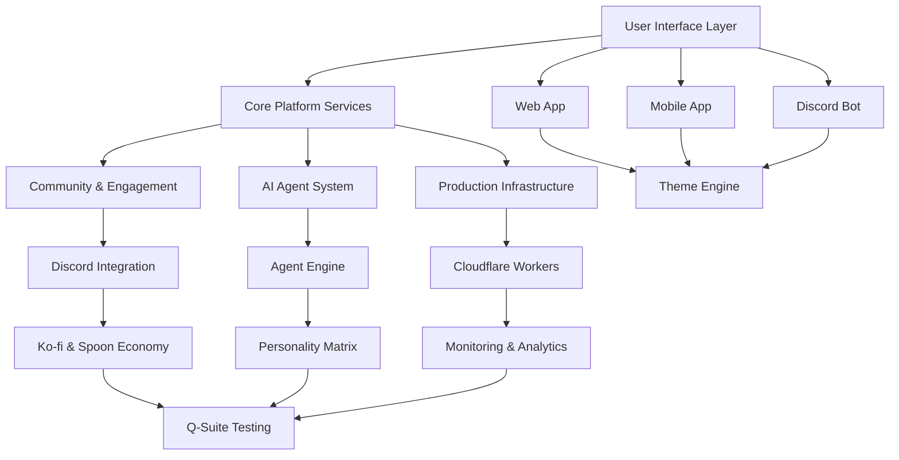

# P31 Andromeda - Complete Integration Guide

**Version:** 1.0.0  
**Date:** 2026-03-23  
**Purpose:** Master integration guide connecting all P31 Andromeda components

---

## 🌐 System Overview & Integration Architecture

### The P31 Andromeda Ecosystem
P31 Andromeda is a comprehensive medical device software platform that seamlessly integrates multiple interconnected systems:



### Integration Points & Data Flow

#### 1. **User Experience Integration**
- **Web App** ↔ **Mobile App** ↔ **Discord Bot** (Unified theme and experience)
- **Agent Creation** ↔ **Community Sharing** (Seamless agent publishing)
- **Spoon Economy** ↔ **All Systems** (Universal reward system)

#### 2. **Data Synchronization**
- **User Profiles** sync across all platforms
- **Agent Data** shared between web, mobile, and Discord
- **Community Activity** tracked and rewarded consistently
- **Node Count** updated in real-time across systems

#### 3. **Authentication & Security**
- **Single Sign-On** across all components
- **Medical Device Compliance** maintained throughout
- **Role-Based Access** consistent across platforms
- **Audit Trails** for all user actions

---

## 🏗️ Component Integration Patterns

### 1. **Theme Engine Integration**

#### Cross-Platform Theme Synchronization
```typescript
// Theme synchronization across all platforms
interface ThemeSyncService {
  // Web App Integration
  webApp: {
    cssVariables: CSSVariableManager;
    responsiveBreakpoints: BreakpointManager;
    accessibilityFeatures: AccessibilityManager;
  };
  
  // Mobile App Integration
  mobileApp: {
    nativeThemeSupport: NativeThemeManager;
    platformSpecificStyles: PlatformStyleManager;
    gestureIntegration: GestureThemeManager;
  };
  
  // Discord Bot Integration
  discordBot: {
    embedThemes: EmbedThemeManager;
    commandThemes: CommandThemeManager;
    reactionThemes: ReactionThemeManager;
  };
  
  // Synchronization Logic
  syncThemes(): Promise<void>;
  validateThemeCompliance(): boolean;
  updateThemeAcrossPlatforms(theme: ThemeConfig): Promise<void>;
}
```

#### Implementation Example
```typescript
// Theme integration service
class ThemeIntegrationService {
  private themeStore: ThemeStore;
  private webApp: WebThemeManager;
  private mobileApp: MobileThemeManager;
  private discordBot: DiscordThemeManager;
  
  async integrateTheme(theme: ThemeConfig): Promise<void> {
    // 1. Validate theme compliance
    if (!this.themeStore.validateCompliance(theme)) {
      throw new Error('Theme does not meet medical device compliance standards');
    }
    
    // 2. Update all platforms simultaneously
    await Promise.all([
      this.webApp.applyTheme(theme),
      this.mobileApp.applyTheme(theme),
      this.discordBot.applyTheme(theme)
    ]);
    
    // 3. Log integration for audit trail
    await this.logThemeIntegration(theme, 'cross-platform');
  }
}
```

### 2. **Agent Engine Integration**

#### Multi-Platform Agent Management
```typescript
// Agent integration across platforms
interface AgentIntegrationService {
  // Agent Creation Flow
  createAgent(agentConfig: AgentCreationConfig): Promise<AgentProfile>;
  
  // Platform-Specific Deployment
  deployToWeb(agentId: string): Promise<void>;
  deployToMobile(agentId: string): Promise<void>;
  deployToDiscord(agentId: string): Promise<void>;
  
  // Cross-Platform Synchronization
  syncAgentState(agentId: string): Promise<void>;
  updateAgentAcrossPlatforms(agentId: string, updates: AgentUpdate): Promise<void>;
  
  // Community Integration
  publishToCommunity(agentId: string, visibility: AgentVisibility): Promise<void>;
  shareAgent(agentId: string, targetPlatform: Platform): Promise<void>;
}
```

#### Agent Lifecycle Integration
```typescript
class AgentLifecycleManager {
  private agentEngine: AgentEngine;
  private communityService: CommunityService;
  private economyService: EconomyService;
  
  async createIntegratedAgent(config: AgentCreationConfig): Promise<AgentProfile> {
    // 1. Create agent in engine
    const agent = await this.agentEngine.createAgent(config);
    
    // 2. Register in community
    await this.communityService.registerAgent(agent);
    
    // 3. Initialize economy integration
    await this.economyService.initializeAgentEconomy(agent.id);
    
    // 4. Deploy to all platforms
    await this.deployAgentToAllPlatforms(agent);
    
    return agent;
  }
  
  private async deployAgentToAllPlatforms(agent: AgentProfile): Promise<void> {
    await Promise.all([
      this.deployToWeb(agent),
      this.deployToMobile(agent),
      this.deployToDiscord(agent)
    ]);
  }
}
```

### 3. **Community & Economy Integration**

#### Spoon Economy Integration
```typescript
// Unified economy system
interface EconomyIntegrationService {
  // Cross-Platform Spoon Management
  earnSpoons(userId: string, amount: number, reason: string, source: Platform): Promise<void>;
  spendSpoons(userId: string, amount: number, reason: string, target: Platform): Promise<void>;
  transferSpoons(fromUser: string, toUser: string, amount: number, reason: string): Promise<void>;
  
  // Platform-Specific Rewards
  rewardWebActivity(userId: string, activity: WebActivity): Promise<void>;
  rewardMobileActivity(userId: string, activity: MobileActivity): Promise<void>;
  rewardDiscordActivity(userId: string, activity: DiscordActivity): Promise<void>;
  
  // Community Economy Features
  distributeCommunityRewards(eventId: string, rewards: RewardDistribution): Promise<void>;
  calculateLeaderboard(): Promise<LeaderboardData>;
  processEconomyTransactions(): Promise<void>;
}
```

#### Community Activity Tracking
```typescript
class CommunityActivityTracker {
  private activityService: ActivityService;
  private economyService: EconomyService;
  private analyticsService: AnalyticsService;
  
  async trackActivity(activity: ActivityEvent): Promise<void> {
    // 1. Record activity
    await this.activityService.recordActivity(activity);
    
    // 2. Award spoons if applicable
    const reward = this.calculateActivityReward(activity);
    if (reward > 0) {
      await this.economyService.earnSpoons(
        activity.userId, 
        reward, 
        activity.type, 
        activity.platform
      );
    }
    
    // 3. Update analytics
    await this.analyticsService.updateActivityMetrics(activity);
    
    // 4. Trigger community notifications
    await this.notifyCommunity(activity);
  }
  
  private calculateActivityReward(activity: ActivityEvent): number {
    const rewardMatrix = {
      'agent_creation': 10,
      'community_help': 5,
      'content_sharing': 3,
      'event_participation': 8,
      'bug_report': 15
    };
    
    return rewardMatrix[activity.type] || 1;
  }
}
```

### 4. **Production Infrastructure Integration**

#### Cloudflare Workers Integration
```typescript
// Production integration service
interface ProductionIntegrationService {
  // Deployment Coordination
  deployToProduction(components: Component[]): Promise<DeploymentResult>;
  rollbackDeployment(deploymentId: string): Promise<void>;
  
  // Monitoring Integration
  setupMonitoring(components: Component[]): Promise<void>;
  configureAlerts(alertConfig: AlertConfiguration): Promise<void>;
  
  // Performance Optimization
  optimizePerformance(components: Component[]): Promise<void>;
  implementCachingStrategy(strategy: CachingStrategy): Promise<void>;
  
  // Security Integration
  implementSecurityMeasures(securityConfig: SecurityConfiguration): Promise<void>;
  validateCompliance(complianceType: ComplianceType): Promise<ComplianceResult>;
}
```

#### Monitoring & Analytics Integration
```typescript
class MonitoringIntegrationService {
  private monitoringService: MonitoringService;
  private analyticsService: AnalyticsService;
  private alertService: AlertService;
  
  async setupIntegratedMonitoring(): Promise<void> {
    // 1. Configure monitoring for all components
    await this.monitoringService.configureMonitoring({
      webApp: { metrics: ['response_time', 'error_rate'] },
      mobileApp: { metrics: ['crash_rate', 'performance'] },
      discordBot: { metrics: ['uptime', 'response_time'] },
      agentEngine: { metrics: ['processing_time', 'success_rate'] }
    });
    
    // 2. Set up cross-component analytics
    await this.analyticsService.setupCrossComponentAnalytics();
    
    // 3. Configure alerting
    await this.alertService.configureAlerts({
      critical: ['system_outage', 'security_breach'],
      warning: ['performance_degradation', 'high_error_rate'],
      info: ['deployment_complete', 'maintenance_scheduled']
    });
  }
}
```

---

## 🔄 Data Flow & Synchronization

### Real-Time Data Synchronization

#### User Data Synchronization
```typescript
// User data sync across platforms
interface UserDataSyncService {
  // Synchronization Patterns
  syncUserProfile(userId: string): Promise<void>;
  syncUserPreferences(userId: string): Promise<void>;
  syncUserActivity(userId: string): Promise<void>;
  
  // Conflict Resolution
  resolveSyncConflicts(userId: string, conflicts: SyncConflict[]): Promise<void>;
  mergeUserData(userData: UserData[]): UserData;
  
  // Real-Time Updates
  setupRealTimeSync(userId: string): Promise<void>;
  broadcastUserUpdate(userId: string, update: UserUpdate): Promise<void>;
}
```

#### Agent Data Synchronization
```typescript
class AgentDataSyncService {
  private agentStore: AgentStore;
  private platformSync: PlatformSyncService;
  
  async syncAgentData(agentId: string): Promise<void> {
    // 1. Get latest agent state
    const agentState = await this.agentStore.getAgentState(agentId);
    
    // 2. Synchronize across platforms
    await this.platformSync.syncToPlatforms(agentId, agentState);
    
    // 3. Update community visibility
    await this.updateCommunityVisibility(agentId, agentState);
    
    // 4. Log synchronization for audit trail
    await this.logSyncOperation(agentId, 'agent_data_sync');
  }
}
```

### Event-Driven Architecture

#### Event Integration Pattern
```typescript
// Event-driven integration
interface EventIntegrationService {
  // Event Types
  handleUserEvent(event: UserEvent): Promise<void>;
  handleAgentEvent(event: AgentEvent): Promise<void>;
  handleCommunityEvent(event: CommunityEvent): Promise<void>;
  handleSystemEvent(event: SystemEvent): Promise<void>;
  
  // Event Processing
  processEvent(event: IntegrationEvent): Promise<void>;
  routeEvent(event: IntegrationEvent): Promise<void>;
  handleEventError(event: IntegrationEvent, error: Error): Promise<void>;
  
  // Event Synchronization
  syncEvents(source: Platform, target: Platform, events: IntegrationEvent[]): Promise<void>;
  ensureEventOrdering(events: IntegrationEvent[]): Promise<void>;
}
```

#### Event Processing Example
```typescript
class EventProcessingService {
  private eventRouter: EventRouter;
  private eventHandlers: Map<string, EventHandler>;
  
  async processIntegrationEvent(event: IntegrationEvent): Promise<void> {
    try {
      // 1. Route event to appropriate handlers
      const handlers = this.eventRouter.getHandlers(event.type);
      
      // 2. Process event through all handlers
      for (const handler of handlers) {
        await handler.handle(event);
      }
      
      // 3. Log successful processing
      await this.logEventProcessing(event, 'success');
      
    } catch (error) {
      // 4. Handle processing error
      await this.handleEventError(event, error);
      throw error;
    }
  }
}
```

---

## 🛡️ Security & Compliance Integration

### Medical Device Compliance Integration

#### Compliance Across All Components
```typescript
// Compliance integration service
interface ComplianceIntegrationService {
  // Cross-Component Compliance
  validateSystemCompliance(): Promise<ComplianceReport>;
  implementComplianceMeasures(components: Component[]): Promise<void>;
  
  // Audit Trail Integration
  setupAuditTrail(components: Component[]): Promise<void>;
  generateComplianceReport(reportType: ReportType): Promise<ComplianceReport>;
  
  // Security Integration
  implementSecurityStandards(components: Component[]): Promise<void>;
  validateSecurityMeasures(): Promise<SecurityReport>;
  
  // Data Protection
  implementDataProtection(components: Component[]): Promise<void>;
  validateDataProtection(): Promise<DataProtectionReport>;
}
```

#### Compliance Validation Example
```typescript
class ComplianceValidationService {
  private complianceChecker: ComplianceChecker;
  private auditService: AuditService;
  
  async validateIntegratedCompliance(): Promise<ComplianceReport> {
    const report: ComplianceReport = {
      timestamp: new Date(),
      components: [],
      overallStatus: 'compliant',
      issues: []
    };
    
    // 1. Validate each component
    for (const component of this.components) {
      const componentReport = await this.complianceChecker.validateComponent(component);
      report.components.push(componentReport);
      
      if (componentReport.status !== 'compliant') {
        report.overallStatus = 'non_compliant';
        report.issues.push(...componentReport.issues);
      }
    }
    
    // 2. Generate audit trail
    await this.auditService.generateAuditTrail(report);
    
    return report;
  }
}
```

### Authentication & Authorization Integration

#### Unified Authentication System
```typescript
// Authentication integration
interface AuthenticationIntegrationService {
  // Single Sign-On
  setupSSO(components: Component[]): Promise<void>;
  validateSSOConfiguration(): Promise<boolean>;
  
  // Role-Based Access
  setupRBAC(components: Component[]): Promise<void>;
  validateRBACConfiguration(): Promise<boolean>;
  
  // Session Management
  setupSessionManagement(components: Component[]): Promise<void>;
  validateSessionSecurity(): Promise<boolean>;
  
  // Token Management
  setupTokenManagement(components: Component[]): Promise<void>;
  validateTokenSecurity(): Promise<boolean>;
}
```

---

## 📊 Monitoring & Analytics Integration

### Cross-Platform Analytics

#### Unified Analytics Dashboard
```typescript
// Analytics integration service
interface AnalyticsIntegrationService {
  // Data Collection
  setupDataCollection(components: Component[]): Promise<void>;
  validateDataQuality(): Promise<boolean>;
  
  // Cross-Platform Metrics
  collectCrossPlatformMetrics(): Promise<CrossPlatformMetrics>;
  generateUnifiedReports(): Promise<UnifiedReport[]>;
  
  // Performance Analytics
  analyzeSystemPerformance(): Promise<PerformanceAnalytics>;
  identifyPerformanceBottlenecks(): Promise<BottleneckAnalysis>;
  
  // User Behavior Analytics
  trackUserJourney(): Promise<UserJourneyAnalytics>;
  analyzeUserEngagement(): Promise<EngagementAnalytics>;
}
```

#### Analytics Integration Example
```typescript
class AnalyticsIntegrationService {
  private analyticsCollector: AnalyticsCollector;
  private dashboardService: DashboardService;
  
  async setupIntegratedAnalytics(): Promise<void> {
    // 1. Configure data collection across all components
    await this.analyticsCollector.configureCollection({
      webApp: { events: ['page_view', 'click', 'conversion'] },
      mobileApp: { events: ['screen_view', 'gesture', 'purchase'] },
      discordBot: { events: ['command', 'interaction', 'message'] },
      agentEngine: { events: ['creation', 'interaction', 'evolution'] }
    });
    
    // 2. Set up unified dashboard
    await this.dashboardService.setupDashboard({
      metrics: ['user_engagement', 'system_performance', 'community_activity'],
      timeframes: ['real_time', 'daily', 'weekly', 'monthly'],
      exportFormats: ['pdf', 'csv', 'json']
    });
  }
}
```

### Performance Monitoring Integration

#### System-Wide Performance Monitoring
```typescript
class PerformanceMonitoringService {
  private performanceMonitors: Map<string, PerformanceMonitor>;
  private alertService: AlertService;
  
  async setupIntegratedPerformanceMonitoring(): Promise<void> {
    // 1. Set up monitoring for each component
    for (const [componentName, monitor] of this.performanceMonitors) {
      await monitor.setupMonitoring({
        metrics: ['response_time', 'error_rate', 'throughput'],
        thresholds: this.getThresholds(componentName),
        alerts: this.getAlerts(componentName)
      });
    }
    
    // 2. Set up cross-component performance analysis
    await this.setupCrossComponentAnalysis();
    
    // 3. Configure system-wide alerts
    await this.alertService.configureSystemAlerts();
  }
  
  private getThresholds(componentName: string): ThresholdConfig {
    const thresholds = {
      'web_app': { response_time: 2000, error_rate: 0.05 },
      'mobile_app': { response_time: 3000, error_rate: 0.03 },
      'discord_bot': { response_time: 1000, error_rate: 0.01 },
      'agent_engine': { response_time: 5000, error_rate: 0.02 }
    };
    
    return thresholds[componentName] || { response_time: 3000, error_rate: 0.05 };
  }
}
```

---

## 🚀 Deployment & Operations Integration

### Continuous Integration/Deployment

#### Multi-Component CI/CD Pipeline
```typescript
// CI/CD integration service
interface CICDIntegrationService {
  // Pipeline Configuration
  setupMultiComponentPipeline(components: Component[]): Promise<void>;
  configureDeploymentStrategies(strategies: DeploymentStrategy[]): Promise<void>;
  
  // Testing Integration
  setupIntegratedTesting(components: Component[]): Promise<void>;
  configureTestEnvironments(environments: TestEnvironment[]): Promise<void>;
  
  // Deployment Coordination
  coordinateComponentDeployment(components: Component[]): Promise<DeploymentResult>;
  handleDeploymentFailures(components: Component[], failures: DeploymentFailure[]): Promise<void>;
  
  // Rollback Management
  setupRollbackProcedures(components: Component[]): Promise<void>;
  executeRollback(deploymentId: string): Promise<void>;
}
```

#### Deployment Pipeline Example
```typescript
class MultiComponentDeploymentService {
  private deploymentOrchestrator: DeploymentOrchestrator;
  private testRunner: TestRunner;
  
  async deployIntegratedSystem(components: Component[]): Promise<DeploymentResult> {
    const deploymentResult: DeploymentResult = {
      deploymentId: generateDeploymentId(),
      startTime: new Date(),
      components: [],
      status: 'in_progress'
    };
    
    try {
      // 1. Run integrated tests
      const testResult = await this.testRunner.runIntegratedTests(components);
      if (!testResult.passed) {
        throw new Error('Integrated tests failed');
      }
      
      // 2. Deploy components in dependency order
      const deploymentOrder = this.getDeploymentOrder(components);
      for (const component of deploymentOrder) {
        const componentResult = await this.deployComponent(component);
        deploymentResult.components.push(componentResult);
      }
      
      // 3. Validate integrated deployment
      await this.validateIntegratedDeployment(components);
      
      deploymentResult.status = 'success';
      deploymentResult.endTime = new Date();
      
    } catch (error) {
      deploymentResult.status = 'failed';
      deploymentResult.error = error.message;
      
      // 4. Execute rollback if deployment failed
      await this.rollbackDeployment(deploymentResult.deploymentId);
    }
    
    return deploymentResult;
  }
}
```

### Infrastructure as Code Integration

#### Terraform/Infrastructure Integration
```typescript
// Infrastructure integration
interface InfrastructureIntegrationService {
  // IaC Management
  setupInfrastructureAsCode(components: Component[]): Promise<void>;
  validateInfrastructureConfiguration(): Promise<boolean>;
  
  // Resource Management
  manageInfrastructureResources(components: Component[]): Promise<void>;
  optimizeResourceAllocation(): Promise<void>;
  
  // Environment Management
  setupEnvironments(environments: Environment[]): Promise<void>;
  manageEnvironmentLifecycle(): Promise<void>;
  
  // Cost Optimization
  analyzeInfrastructureCosts(): Promise<CostAnalysis>;
  implementCostOptimization(): Promise<void>;
}
```

---

## 🎯 Best Practices & Guidelines

### Integration Best Practices

#### 1. **Data Consistency**
```typescript
// Ensure data consistency across components
class DataConsistencyManager {
  async ensureDataConsistency(components: Component[]): Promise<void> {
    // Implement eventual consistency patterns
    // Use distributed transactions where needed
    // Implement conflict resolution strategies
    // Monitor data synchronization health
  }
}
```

#### 2. **Error Handling**
```typescript
// Comprehensive error handling
class ErrorHandlingManager {
  async handleIntegrationError(error: IntegrationError): Promise<void> {
    // Log error with context
    await this.logError(error);
    
    // Notify relevant components
    await this.notifyComponents(error);
    
    // Execute recovery procedures
    await this.executeRecovery(error);
    
    // Update monitoring and alerting
    await this.updateMonitoring(error);
  }
}
```

#### 3. **Performance Optimization**
```typescript
// Performance optimization across components
class PerformanceOptimizer {
  async optimizeIntegratedPerformance(components: Component[]): Promise<void> {
    // Identify performance bottlenecks
    const bottlenecks = await this.identifyBottlenecks(components);
    
    // Implement caching strategies
    await this.implementCaching(components);
    
    // Optimize data synchronization
    await this.optimizeDataSync(components);
    
    // Monitor performance improvements
    await this.monitorPerformance(components);
  }
}
```

### Troubleshooting Guide

#### Common Integration Issues

1. **Data Synchronization Problems**
   - Check network connectivity between components
   - Verify database connection strings and credentials
   - Review synchronization schedules and timeouts
   - Monitor for data conflicts and resolution

2. **Authentication Failures**
   - Verify SSO configuration across all components
   - Check token expiration and refresh mechanisms
   - Validate role assignments and permissions
   - Review security certificate validity

3. **Performance Degradation**
   - Monitor resource usage across components
   - Check for database connection pool exhaustion
   - Review API rate limiting and throttling
   - Analyze network latency between services

4. **Deployment Failures**
   - Verify component dependencies and order
   - Check environment configuration consistency
   - Review rollback procedures and testing
   - Validate infrastructure provisioning

### Monitoring & Maintenance

#### Regular Maintenance Tasks

1. **Daily Tasks**
   - Monitor system health and performance
   - Review error logs and alerts
   - Check data synchronization status
   - Validate backup operations

2. **Weekly Tasks**
   - Analyze system performance trends
   - Review security logs and access patterns
   - Update component configurations as needed
   - Test disaster recovery procedures

3. **Monthly Tasks**
   - Perform comprehensive system audits
   - Review and update security measures
   - Analyze cost optimization opportunities
   - Plan capacity and scaling needs

4. **Quarterly Tasks**
   - Update compliance documentation
   - Review and update disaster recovery plans
   - Perform security penetration testing
   - Evaluate system architecture and scalability

---

## 📋 Integration Checklist

### Pre-Integration Checklist
- [ ] All components are individually tested and functional
- [ ] Database schemas are compatible and synchronized
- [ ] API contracts are defined and validated
- [ ] Security measures are implemented and tested
- [ ] Monitoring and logging are configured
- [ ] Backup and recovery procedures are established

### Integration Testing Checklist
- [ ] End-to-end user workflows are tested
- [ ] Data synchronization is validated
- [ ] Error handling is tested across components
- [ ] Performance benchmarks are met
- [ ] Security integration is verified
- [ ] Compliance requirements are validated

### Production Deployment Checklist
- [ ] All integration tests pass
- [ ] Monitoring dashboards are configured
- [ ] Alert thresholds are set and tested
- [ ] Rollback procedures are documented and tested
- [ ] Documentation is complete and up-to-date
- [ ] Team training is completed

### Post-Deployment Checklist
- [ ] System health is monitored for 24-48 hours
- [ ] User feedback is collected and analyzed
- [ ] Performance metrics are reviewed
- [ ] Security logs are monitored
- [ ] Integration issues are resolved
- [ ] Lessons learned are documented

---

## 🎉 Conclusion

The P31 Andromeda integration represents a sophisticated, multi-component system that seamlessly connects:

- **User Experience** across web, mobile, and Discord platforms
- **AI Agent Creation** with community sharing and economy integration
- **Production Infrastructure** with comprehensive monitoring and security
- **Community Engagement** with gamification and reward systems

This integration guide provides the foundation for maintaining and evolving this complex ecosystem while ensuring medical device compliance, security, and optimal user experience.

The key to successful integration lies in:
1. **Consistent Data Flow** across all components
2. **Unified Authentication** and security measures
3. **Comprehensive Monitoring** and alerting
4. **Robust Error Handling** and recovery procedures
5. **Regular Maintenance** and optimization
6. **Continuous Compliance** validation and improvement

By following this integration guide, teams can ensure that P31 Andromeda operates as a cohesive, reliable, and scalable platform that delivers exceptional value to its users while maintaining the highest standards of medical device software quality and compliance.

---

**Classification**: P31 Labs Integration Documentation  
**Distribution**: Development Team, Operations Team, and Management  
**Review Cycle**: Quarterly integration reviews and updates