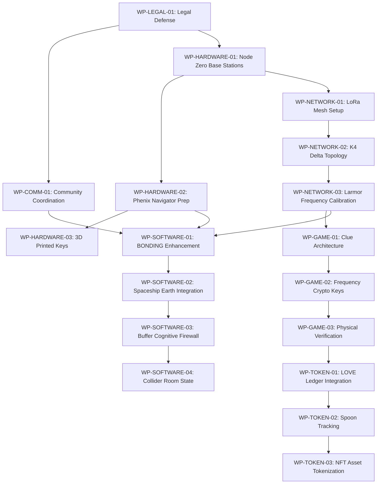

# P31 Labs Easter 2026 Savannah "Quantum Egg Hunt" Deployment
## Discrete Work Packages - Work Control Document

**Document Status:** ARCHITECTURAL PLANNING  
**Target Event:** Easter 2026 (April 5, 2026)  
**Location:** Savannah, GA  
**Current Date:** March 24, 2026 (T-12 days)  
**Author:** Architect Mode  

---

## Executive Summary

This document defines discrete work packages for the P31 Labs Savannah Quantum Egg Hunt deployment. The event combines physical hardware deployment (3D-printed keys, ESP32-S3 nodes) with software systems (BONDING, Spaceship Earth, The Buffer) to create an immersive geometric scavenger hunt experience.

**Critical Timeline Constraints:**
- Discovery deadline: March 26, 2026
- Psychiatrist appointment: March 24, 2026 (TODAY)
- Easter Sunday: April 5, 2026
- Available working days: ~10

---

## Work Package Dependency Graph



---

## Work Package Index

| WP ID | Domain | Title | Priority | Dependencies |
|-------|--------|-------|----------|--------------|
| WP-LEGAL-01 | Legal | Johnson v. Johnson Response | CRITICAL | None |
| WP-COMM-01 | Community | Savannah Event Coordination | HIGH | WP-LEGAL-01 |
| WP-HARDWARE-01 | Hardware | Node Zero Base Stations | HIGH | WP-LEGAL-01 |
| WP-HARDWARE-02 | Hardware | Phenix Navigator ESP32-S3 Prep | HIGH | WP-HARDWARE-01 |
| WP-HARDWARE-03 | Hardware | 3D Printed Physical Keys | MEDIUM | WP-HARDWARE-02 |
| WP-NETWORK-01 | Network | LoRa Mesh Setup | HIGH | WP-HARDWARE-01 |
| WP-NETWORK-02 | Network | K4 Delta Topology | HIGH | WP-NETWORK-01 |
| WP-NETWORK-03 | Network | Larmor Frequency Calibration | HIGH | WP-NETWORK-02 |
| WP-SOFTWARE-01 | Software | BONDING Enhancement | HIGH | WP-NETWORK-03, WP-HARDWARE-02 |
| WP-SOFTWARE-02 | Software | Spaceship Earth Integration | MEDIUM | WP-SOFTWARE-01 |
| WP-SOFTWARE-03 | Software | Buffer Cognitive Firewall | MEDIUM | WP-SOFTWARE-02 |
| WP-SOFTWARE-04 | Software | Collider Room State Resolution | MEDIUM | WP-SOFTWARE-03 |
| WP-GAME-01 | Gamification | Clue Architecture | HIGH | WP-NETWORK-03 |
| WP-GAME-02 | Gamification | Frequency Crypto Keys | HIGH | WP-GAME-01 |
| WP-GAME-03 | Gamification | Physical Verification System | HIGH | WP-GAME-02 |
| WP-TOKEN-01 | Token | LOVE Ledger Integration | MEDIUM | WP-GAME-03 |
| WP-TOKEN-02 | Token | Spoon Tracking | MEDIUM | WP-TOKEN-01 |
| WP-TOKEN-03 | Token | NFT Asset Tokenization | LOW | WP-TOKEN-02 |

---

## Detailed Work Packages

### WP-LEGAL-01: Legal Defense Integration
**Domain:** Legal/Defense  
**Priority:** CRITICAL  
**Dependencies:** None  

**Scope:**
- Complete discovery response by March 26 deadline
- Prepare differential diagnosis documentation for psychiatrist (TODAY March 24)
- Class II Medical Device classification research for Phenix Navigator
- Prior art documentation for defensive publications
- Johnson v. Johnson case response coordination

**Deliverables:**
- [ ] Discovery response filed with court
- [ ] Psychiatrist appointment documentation package
- [ ] Class II Medical Device classification memo
- [ ] Prior art registry update

**Effort:** High (requires immediate attention, blocking all other work)

---

### WP-COMM-01: Community/Event Coordination
**Domain:** Community  
**Priority:** HIGH  
**Dependencies:** WP-LEGAL-01  

**Scope:**
- Savannah physical deployment logistics
- Parallel play coordination via BONDING
- 3D printing manufacturing schedule
- Community outreach for event participation
- Ko-fi shop coordination for digital assets

**Deliverables:**
- [ ] Savannah deployment checklist
- [ ] Parallel play schedule
- [ ] 3D printing production queue
- [ ] Community communication plan

**Effort:** Medium

---

### WP-HARDWARE-01: Node Zero Base Stations
**Domain:** Hardware  
**Priority:** HIGH  
**Dependencies:** WP-LEGAL-01  

**Scope:**
- Deploy Node Zero base stations at Savannah event locations
- Configure ESP32-S3 for base station mode
- Set up power management and weatherproofing
- Establish initial mesh network anchors

**Deliverables:**
- [ ] 4x Node Zero base stations configured
- [ ] Base station placement map
- [ ] Power and network verification

**Effort:** High (requires hardware procurement and configuration)

---

### WP-HARDWARE-02: Phenix Navigator ESP32-S3 Prep
**Domain:** Hardware  
**Priority:** HIGH  
**Dependencies:** WP-HARDWARE-01  

**Scope:**
- Flash firmware to Phenix Navigator devices
- Configure haptic feedback (DRV2605L)
- Set up LoRa mesh connectivity (SX1262)
- Configure NXP SE050 HSM
- Load Genesis Block for event

**Deliverables:**
- [ ] 10x Phenix Navigator devices flashed
- [ ] Haptic feedback calibration
- [ ] LoRa mesh connectivity verified
- [ ] Genesis Block loaded

**Effort:** High (firmware and hardware integration)

---

### WP-HARDWARE-03: 3D Printed Physical Keys
**Domain:** Hardware  
**Priority:** MEDIUM  
**Dependencies:** WP-HARDWARE-02  

**Scope:**
- Print CAD files for physical key tokens
- Embed NFC tags for digital verification
- Apply Phosphor Green (#00FF88) coating
- Create geometric key designs (tetrahedral, IVM)

**Deliverables:**
- [ ] 50x 3D printed physical keys
- [ ] NFC tag integration
- [ ] Quality verification

**Effort:** Medium (requires 3D printer access)

---

### WP-NETWORK-01: LoRa Mesh Setup
**Domain:** Network  
**Priority:** HIGH  
**Dependencies:** WP-HARDWARE-01  

**Scope:**
- Configure LoRa SX1262 modules for mesh operation
- Set up 868MHz/915MHz frequency bands
- Implement mesh routing protocol
- Establish Tailscale integration for remote monitoring

**Deliverables:**
- [ ] LoRa mesh network operational
- [ ] Mesh routing verified
- [ ] Remote access configured

**Effort:** High (requires RF expertise)

---

### WP-NETWORK-02: K4 Delta Topology
**Domain:** Network  
**Priority:** HIGH  
**Dependencies:** WP-NETWORK-01  

**Scope:**
- Implement K4 (complete graph, 4 nodes, 6 edges) Delta topology
- Configure redundant communication paths
- Set up failover mechanisms
- Document network topology for event

**Deliverables:**
- [ ] K4 Delta topology implemented
- [ ] Redundancy testing complete
- [ ] Network topology documentation

**Effort:** High (network architecture)

---

### WP-NETWORK-03: Larmor Frequency Calibration
**Domain:** Network  
**Priority:** HIGH  
**Dependencies:** WP-NETWORK-02  

**Scope:**
- Calibrate 172.35 Hz phosphorus-31 NMR frequency
- Calibrate 863 Hz Larmor frequency (31P in Earth's field)
- Implement frequency-based cryptographic signaling
- Test frequency reception at Savannah locations

**Deliverables:**
- [ ] 172.35 Hz calibration complete
- [ ] 863 Hz calibration complete
- [ ] Frequency crypto system operational
- [ ] Field testing verified

**Effort:** High (requires precision calibration)

---

### WP-SOFTWARE-01: BONDING Enhancement
**Domain:** Software  
**Priority:** HIGH  
**Dependencies:** WP-NETWORK-03, WP-HARDWARE-02  

**Scope:**
- Add Savannah event-specific quest chains
- Integrate hardware node detection
- Implement frequency-based clue reveals
- Add physical key NFC verification
- Enhance multiplayer for parallel play

**Deliverables:**
- [ ] Savannah quest chains added
- [ ] Hardware integration complete
- [ ] Frequency clue system operational
- [ ] NFC verification implemented

**Effort:** High (software development)

---

### WP-SOFTWARE-02: Spaceship Earth Integration
**Domain:** Software  
**Priority:** MEDIUM  
**Dependencies:** WP-SOFTWARE-01  

**Scope:**
- Integrate BONDING as room in Spaceship Earth
- Add Savannah event visualization
- Implement Observatory room data display
- Connect Collider Room for particle events

**Deliverables:**
- [ ] BONDING room integration
- [ ] Savannah event visualization
- [ ] Observatory data connected

**Effort:** Medium (integration work)

---

### WP-SOFTWARE-03: Buffer Cognitive Firewall
**Domain:** Software  
**Priority:** MEDIUM  
**Dependencies:** WP-SOFTWARE-02  

**Scope:**
- Complete Buffer cognitive firewall (~85% complete per passport)
- Implement message scoring system
- Add Fawn Guard functionality
- Connect to event communication channels

**Deliverables:**
- [ ] Buffer dashboard operational
- [ ] Message scoring implemented
- [ ] Fawn Guard active

**Effort:** Medium (completion of existing work)

---

### WP-SOFTWARE-04: Collider Room State Resolution
**Domain:** Software  
**Priority:** MEDIUM  
**Dependencies:** WP-SOFTWARE-03  

**Scope:**
- Implement particle collider state resolution
- Add beam selection (p+, e-, e+, 31P)
- Implement energy slider (5-300 GeV)
- Add detector ring collision events

**Deliverables:**
- [ ] Collider Room operational
- [ ] State resolution complete
- [ ] Collision detection working

**Effort:** Medium (game physics)

---

### WP-GAME-01: Clue Architecture
**Domain:** Gamification  
**Priority:** HIGH  
**Dependencies:** WP-NETWORK-03  

**Scope:**
- Design geometric clue system (tetrahedral structure)
- Create difficulty tiers (Seed/Sprout/Sapling)
- Implement time-based clue reveals
- Add hint escalation system

**Deliverables:**
- [ ] Clue architecture document
- [ ] Difficulty tier implementation
- [ ] Hint system configured

**Effort:** High (game design)

---

### WP-GAME-02: Frequency Crypto Keys
**Domain:** Gamification  
**Priority:** HIGH  
**Dependencies:** WP-GAME-01  

**Scope:**
- Implement frequency-based cryptographic keys
- Create 172.35 Hz unlock sequences
- Add 863 Hz verification signals
- Design frequency puzzle mechanics

**Deliverables:**
- [ ] Frequency crypto system
- [ ] Unlock sequences implemented
- [ ] Puzzle mechanics complete

**Effort:** High (cryptographic implementation)

---

### WP-GAME-03: Physical Verification System
**Domain:** Gamification  
**Priority:** HIGH  
**Dependencies:** WP-GAME-02  

**Scope:**
- Implement NFC tag scanning for physical keys
- Create geometric verification (tetrahedral alignment)
- Add QR code fallback system
- Design multi-factor verification (frequency + NFC + geometric)

**Deliverables:**
- [ ] NFC verification system
- [ ] Geometric verification
- [ ] Multi-factor verification complete

**Effort:** High (hardware/software integration)

---

### WP-TOKEN-01: LOVE Ledger Integration
**Domain:** Token Economy  
**Priority:** MEDIUM  
**Dependencies:** WP-GAME-03  

**Scope:**
- Integrate L.O.V.E. (Ledger of Ontological Volume and Entropy)
- Implement soulbound token mechanics
- Add LOVE earning through care/creation/consistency
- Connect to BONDING engagement system

**Deliverables:**
- [ ] LOVE ledger operational
- [ ] Soulbound mechanics implemented
- [ ] Engagement integration complete

**Effort:** Medium (tokenomics)

---

### WP-TOKEN-02: Spoon Tracking
**Domain:** Token Economy  
**Priority:** MEDIUM  
**Dependencies:** WP-TOKEN-01  

**Scope:**
- Implement Spoon tracking (cognitive energy units)
- Add Spoon expenditure monitoring
- Create Spoon recovery mechanics
- Connect to Buffer cognitive load system

**Deliverables:**
- [ ] Spoon tracking operational
- [ ] Expenditure monitoring
- [ ] Recovery mechanics implemented

**Effort:** Medium (energy system)

---

### WP-TOKEN-03: NFT Asset Tokenization
**Domain:** Token Economy  
**Priority:** LOW  
**Dependencies:** WP-TOKEN-02  

**Scope:**
- Implement Simple NFTs for physical asset tokenization
- Create key token representations
- Add ownership verification
- Design collectible mechanics

**Deliverables:**
- [ ] NFT system designed
- [ ] Key tokens implemented
- [ ] Collectible mechanics complete

**Effort:** Low (nice-to-have, can be deferred)

---

## Priority Matrix

### Must Complete (Blockers)
1. WP-LEGAL-01 - Legal Defense (CRITICAL - deadline March 26)
2. WP-NETWORK-03 - Larmor Frequency Calibration (enables clues)
3. WP-GAME-01 - Clue Architecture (enables gameplay)
4. WP-GAME-02 - Frequency Crypto Keys (enables verification)
5. WP-GAME-03 - Physical Verification (enables physical hunt)

### Should Complete (Core Experience)
6. WP-HARDWARE-01 - Node Zero Base Stations
7. WP-HARDWARE-02 - Phenix Navigator Prep
8. WP-NETWORK-01 - LoRa Mesh Setup
9. WP-NETWORK-02 - K4 Delta Topology
10. WP-SOFTWARE-01 - BONDING Enhancement
11. WP-COMM-01 - Community Coordination

### Nice to Have (Enhancements)
12. WP-HARDWARE-03 - 3D Printed Keys
13. WP-SOFTWARE-02 - Spaceship Earth Integration
14. WP-SOFTWARE-03 - Buffer Cognitive Firewall
15. WP-SOFTWARE-04 - Collider Room State
16. WP-TOKEN-01 - LOVE Ledger Integration
17. WP-TOKEN-02 - Spoon Tracking
18. WP-TOKEN-03 - NFT Asset Tokenization

---

## Execution Sequence

### Phase 1: Legal & Foundation (March 24-26)
```
Day 1 (Mar 24): WP-LEGAL-01 [ALL DAY - psychiatrist appointment]
Day 2 (Mar 25): WP-LEGAL-01 [discovery response finalization]
Day 3 (Mar 26): WP-LEGAL-01 [file discovery response]
```

### Phase 2: Infrastructure (March 27-30)
```
Day 4 (Mar 27): WP-HARDWARE-01, WP-NETWORK-01
Day 5 (Mar 28): WP-HARDWARE-02, WP-NETWORK-02
Day 6 (Mar 29): WP-NETWORK-03, WP-GAME-01
Day 7 (Mar 30): WP-GAME-02, WP-GAME-03
```

### Phase 3: Software Integration (March 31 - April 2)
```
Day 8 (Mar 31): WP-SOFTWARE-01
Day 9 (Apr 1):  WP-SOFTWARE-02, WP-COMM-01
Day 10 (Apr 2): WP-SOFTWARE-03, WP-TOKEN-01
```

### Phase 4: Final Testing (April 3-4)
```
Day 11 (Apr 3): Integration testing, bug fixes
Day 12 (Apr 4): Field testing, final prep
```

### Phase 5: Deployment (April 5)
```
Easter Sunday: Savannah Quantum Egg Hunt Deployment
```

---

## Risk Assessment

| Risk | Likelihood | Impact | Mitigation |
|------|------------|--------|------------|
| Legal deadline missed | Low | Critical | WP-LEGAL-01 is priority, no parallel work until filed |
| Hardware not ready | Medium | High | Order ESP32-S3 units immediately, use Node Zero as fallback |
| LoRa mesh interference | Medium | Medium | Pre-test in Savannah, have backup cellular |
| Frequency calibration drift | Medium | High | Recalibrate day-of, have backup verification |
| Software integration delays | High | Medium | Prioritize core gameplay, defer enhancements |

---

## Resource Requirements

### Personnel
- Will (Operator): Legal, hardware, software coordination
- Tyler (Beta tester): Network testing, field deployment
- Brenda (Board): Event coordination, ADA support

### Hardware
- ESP32-S3 Dev Kit x10
- LoRa SX1262 modules x10
- DRV2605L haptic drivers x10
- NXP SE050 HSM x10
- 3D printer access (50+ hours)
- NFC tags x50

### Software
- Cloudflare Pages deployment
- Cloudflare Workers for relay
- Vite + React + R3F build
- Zustand state management

---

## Success Criteria

- [ ] Legal defense filed by March 26
- [ ] Hardware nodes operational by April 3
- [ ] LoRa mesh functional at Savannah locations
- [ ] Frequency calibration verified
- [ ] Clue system operational
- [ ] Physical verification working
- [ ] BONDING enhanced for event
- [ ] Community coordination complete

---

*This document serves as the master work breakdown for the P31 Labs Easter 2026 Savannah Quantum Egg Hunt deployment. All work packages are to be executed in dependency order with priority given to critical path items.*
